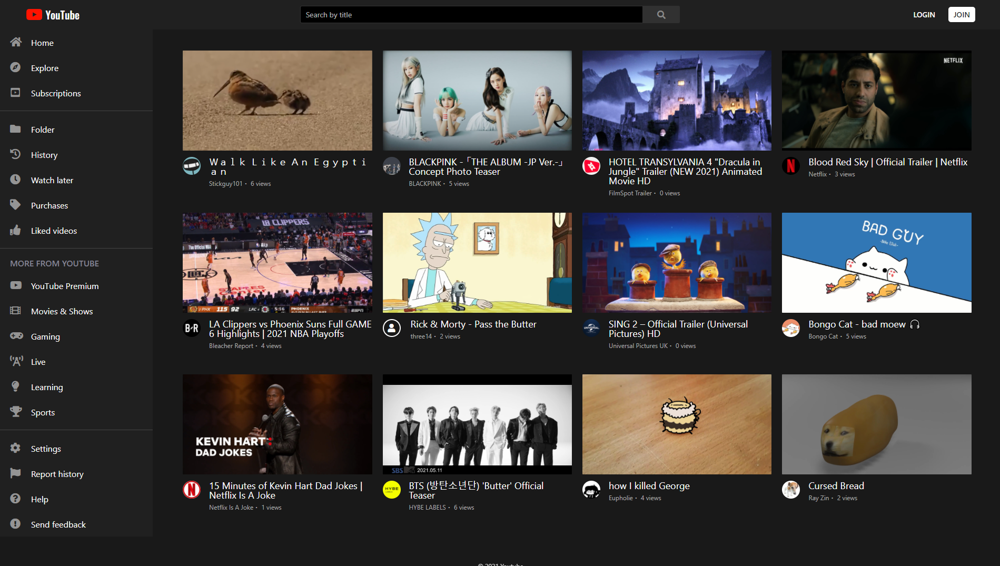
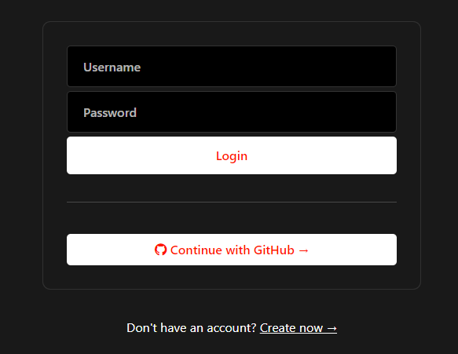
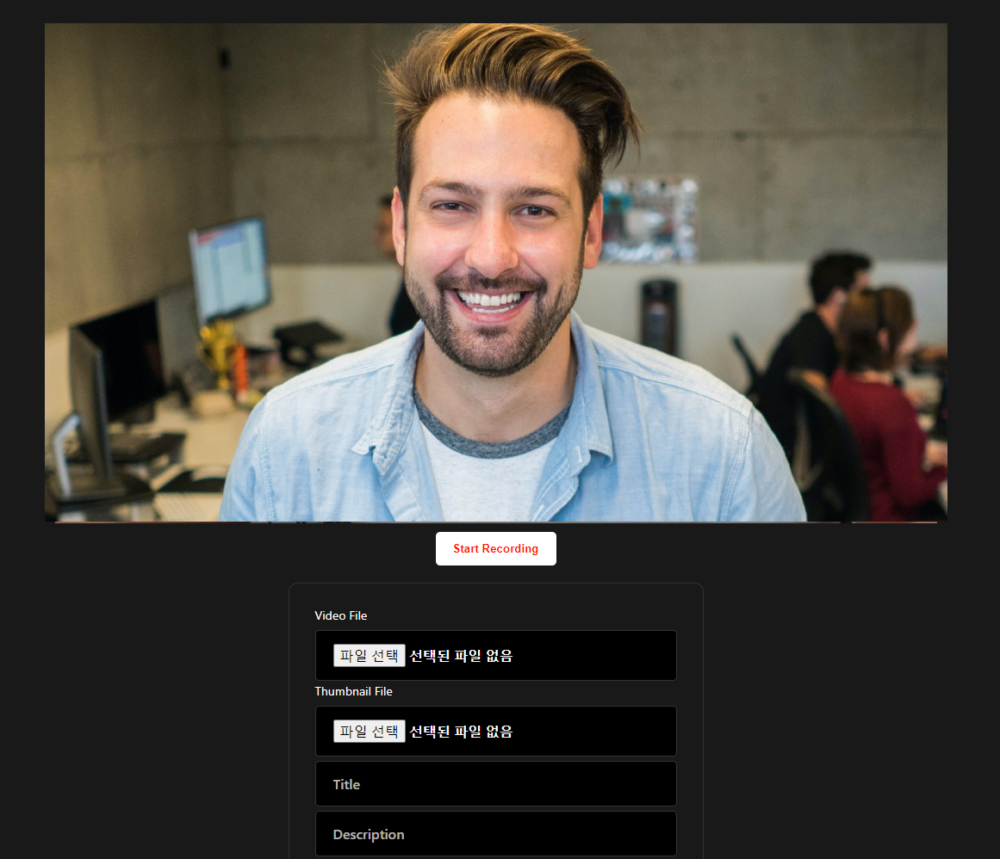
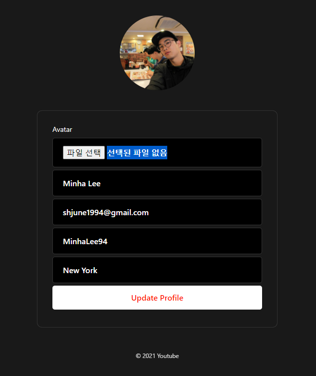
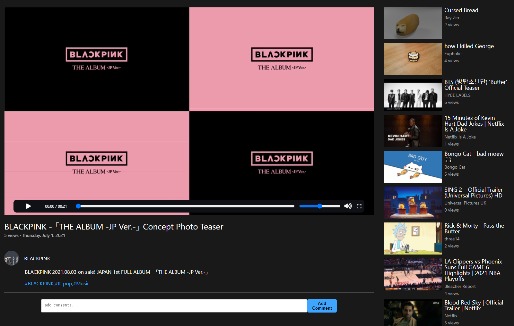

<h1 align="center">YouTube Clone</h1>

# YouTube Clone with CRUD system

You can create, remove, update and delete users and videos.

[Dive into demo site] (https://youtube-clone-revised.herokuapp.com/) :house:

 
   

 

# How to use

## Login :credit_card:

You can login with own ID as well as GitHub ID.

If you don't have any ID, then you can access to create ID page by one click.

---

## Recording :camera:

You can directly record and download a video using an webcam attached to your computer.

---

## Profile :file_folder:

You can upload your avatar and if you change your avatar,

all pages and videos using the avatar will be updated simultaneously.

---

## Video Player :tv:

You can start the video with space bar or simply click on the video, and you can also move to the other videos by clicking the list on the side.

It automatically counts and save views everytime when any user watches the video. Users can also put the comments on videos and see comments of others.

---

## Technologies Used

**javascript(ES6+)**

**node.js:** JavaScript runtime environment

**express:** Backend web framework for node.js

**AWS(s3):** To store the actual data

**mongoDB:** To store the address of data

**webpack:** To enable compatibility of new features of js or scss

**scss:** More manageable and advanced css

**pug:** Templete engine for the browser

**FFmpeg:** To convert videos to unified video format by using users' computer

For development: **babel, nodemon, multer**
